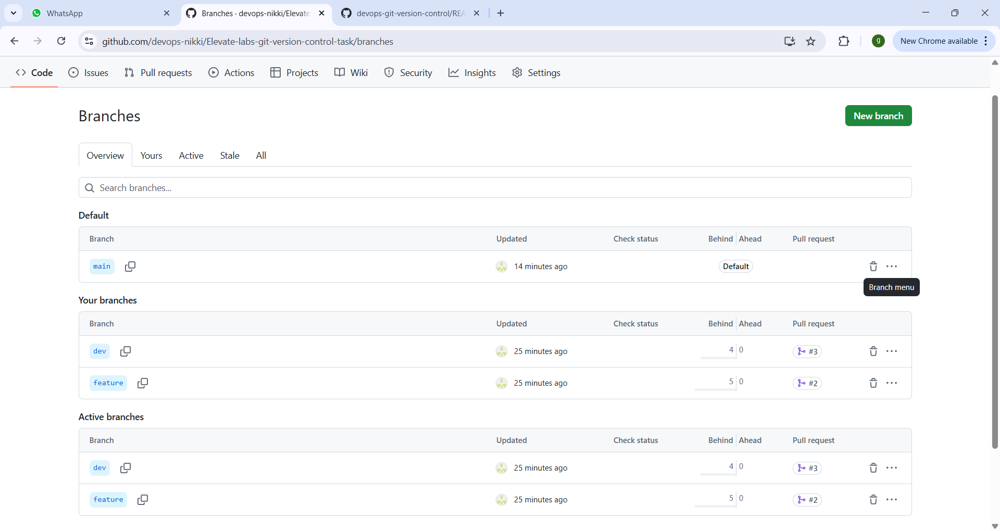
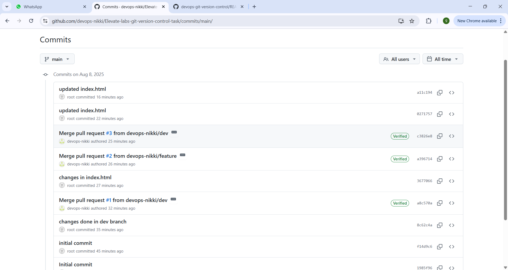

# Devops-git-version-control-TAsk-4
A Git version control practices project created for the DevOps internship task.
This project demonstrates best practices in managing a DevOps project using Git, including branching strategies, pull requests, tagging, and CI integration.
---
## Table of Contents
- Project Overview
- Features
- Directory Structure
- Getting Started
- Branching Strategy
- Continuous Integration (CI)
- Contributing
- License
- Contact
---
## Project Overview
This repository aims to help you learn and implement version control workflows effectively in a DevOps environment. It includes practical examples of Git commands, branching workflows, and automation using GitHub Actions.
---
## Features
- Git branching: main, dev, and feature/* branches
- Use of pull requests (PRs) for merging code
- Semantic versioning with Git tags
- GitHub Actions for Continuous Integration (CI)
- Documentation of Git workflows and commands
-
---
## Directory Structure

devops-git-task/
├── README.md
├── scripts/
│   └── setup.sh
|---Screenshots
|---scr/
|    |__index.html
├── docs/
│   └── task_notes.md
└── .github/
      └── workflows/
             └── ci.yml

- scripts/ — contains automation scripts
- docs/ — documentation related to Git workflows
- scr/index.html — sampple web page for git
- .github/workflows/ — GitHub Actions workflow configuration
- Screenshots/- For verifying Output
---
## Getting Started
### Prerequisites
- Git installed on your system
- A GitHub account
---
## Clone the Repository

```
git clone https://github.com/devops-nikki/Elevate-labs-git-version-control-task.git
cd devops-git-task
```
---
## Branch Usage
- Work on dev branch for ongoing development
- Create feature branches off dev for new features/fixes
- Use pull requests to merge changes to dev and then to main
---
##  Branching Strategy

| Branch       | Purpose                              |
|--------------|--------------------------------------|
| `main`       | Production-ready code                |
| `dev`        | Integration and ongoing development  |
| `feature/*`  | Feature-specific branches off `dev`  |

- Pull requests are required to merge `feature/*` branches into `dev`, and `dev` into `main`.
---
## Continuous Integration (CI)
This project uses GitHub Actions to automate builds and checks on each push or pull request.

Workflow file: `.github/workflows/ci.yml`
---
## Screenshots

- Branches

- Github Actions

- Commits

- Release Tags

- Merge branch

- Pull Request

---

## ✅ Outcome

- This project helped in:
- Practicing real-world Git collaboration workflows
- Writing clean project documentation
- Using GitHub Actions for simple CI
---
## Contributing
Feel free to fork the repository and submit pull requests. Please follow the branching strategy and write clear commit messages.
---
## License
This project is licensed under the MIT License. See the LICENSE file for details.
---
## Contact
Nikki Goyal 
GitHub: https://github.com/devops-nikki
LinkedIn: https://www.linkedin.com/in/nikki-goyal-devops 

Happy Git branching and merging! 🚀
